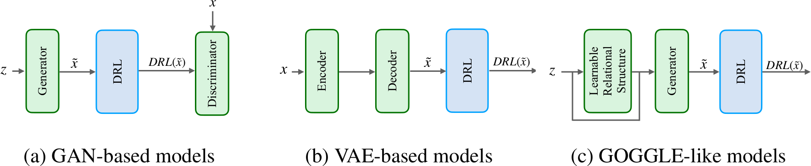

# DRL_DGM: Deep Generative Modelling with the Disjunctive Refiniment Layer (DRL)

This repository contains the code for the constraint layer proposed in our paper titled "**Beyond the Convexity Assumption: Realistic Tabular Data Generation under Quantifier-Free Real Linear Constraints**", which was accepted for publication at ICLR 2025. 

Synthetic tabular data generation has traditionally been a challenging problem due to the high complexity of the underlying distributions that characterise this type of data. Despite recent advances in deep generative models (DGMs), existing methods often fail to produce realistic datapoints that are well-aligned with available background knowledge. In this paper, we address this limitation by introducing Disjunctive Refinement Layer (DRL), a novel layer designed to enforce the alignment of generated data with the background knowledge specified in user-defined constraints. DRL is the first method able to automatically make deep learning models inherently compliant with constraints as expressive as quantifier-free linear formulas, which can define non-convex and even disconnected spaces. Our experimental analysis shows that DRL not only guarantees constraint satisfaction but also improves efficacy in downstream tasks. Notably, when applied to DGMs that frequently violate constraints, DRL eliminates violations entirely. Further, it improves performance metrics by up to 21.4% in F1-score and 20.9% in Area Under the ROC Curve, thus demonstrating its practical impact on data generation.

[//]: # ()


Figure: Visualisations of the considered types of DGMs and how to add DRL in their topology.


If you use this paper, please cite the following:
```
@inproceedings{stoian2025drl,
title={{Beyond the convexity assumption: Realistic tabular data generation under quantifier-free real linear constraints}},
author={Mihaela C. Stoian and Eleonora Giunchiglia},
booktitle={Proceedings of the Thirteenth International Conference on Learning Representations},
year={2025},
url={https://openreview.net/forum?id=rx0TCew0Lj}
}
```

As of now, the models included in this repository (on top of which we applied DRL) are: CTGAN [1], TVAE [1], TableGAN [2], and WGAN [3]. 


## Dependencies
````
conda create -n "drl_env" python=3.10 ipython
conda activate drl_env
conda install pytorch torchvision torchaudio cpuonly -c pytorch
pip install sdv
pip install autograd
pip install wandb
pip install synthcity
````

## Examples
FICO’s Home Equity Line of Credit dataset (Heloc) from the FICO xML Challenge is available [here](https://huggingface.co/datasets/mstz/heloc).
To download the other datasets, please refer to the appendix of our paper where we detail the datasets we used.

Scripts to split the data into train, validation and testing partitions are available in the `other_helper_scripts` directory of this repository.

### WGAN

```
use_case="heloc"
eps=300
default_optimiser="adam"
disc_repeats=5
default_lr=0.0010
default_bs=256
default_pac=1
seed=0

# unconstrained
python main_wgan.py ${use_case} --seed=$seed --epochs=$eps --disc_repeats=${disc_repeats} --optimiser=${default_optimiser} --d_lr=${default_lr} --g_lr=${default_lr} --pac=${default_pac} --batch_size=${default_bs} --version=unconstrained

# constrained
python main_wgan.py ${use_case} --seed=$seed --epochs=$eps --disc_repeats=${disc_repeats} --optimiser=${default_optimiser} --d_lr=${default_lr} --g_lr=${default_lr} --pac=${default_pac} --batch_size=${default_bs} --version=constrained --label_ordering="kde"
```
### TableGAN

```
use_case="heloc"
eps=300
default_optimiser="adam"
default_lr=0.0010
default_bs=128
default_random_dim=100
seed=0

# unconstrained
python main_tableGAN.py ${use_case} --seed=$seed --epochs=$eps --optimiser=${default_optimiser} --lr=${default_lr} --batch_size=${default_bs} --random_dim=${default_random_dim}

# constrained
python main_tableGAN.py ${use_case} --seed=$seed --epochs=$eps --optimiser=${default_optimiser} --lr=${default_lr} --batch_size=${default_bs} --random_dim=${default_random_dim} --version="constrained" --label_ordering="corr"
```
### CTGAN
```

use_case="heloc"
eps=150
default_optimiser="adam"
default_lr=0.0002
default_bs=500
default_decay=0.000001
default_pac=1
seed=0

# unconstrained
python main_ctgan.py  ${use_case} --wandb_project=$wandbp --seed=$seed --epochs=$eps --optimiser=${default_optimiser} --generator_lr=${default_lr} --discriminator_lr=${default_lr} --batch_size=${default_bs} --generator_decay=${default_decay} --discriminator_decay=${default_decay} --pac=${default_pac}

# constrained
python main_ctgan.py  ${use_case} --wandb_project=$wandbp --seed=$seed --epochs=$eps --optimiser=${default_optimiser} --generator_lr=${default_lr} --discriminator_lr=${default_lr} --batch_size=${default_bs} --generator_decay=${default_decay} --discriminator_decay=${default_decay} --pac=${default_pac} --version="constrained" --label_ordering="random"
```

### TVAE
```
use_case="heloc"
seed=0
eps=150
bs=70
l2scale=0.0002
loss_factor=2

# unconstrained
python main_tvae.py  ${use_case} --wandb_project=$wandbp --seed=$seed --epochs=$eps  --batch_size=${bs} --l2scale=${l2scale} --loss_factor=${loss_factor}

# constrained
python main_tvae.py  ${use_case} --wandb_project=$wandbp --seed=$seed --epochs=$eps  --batch_size=${bs} --l2scale=${l2scale} --loss_factor=${loss_factor} --version="constrained" --label_ordering="random"

```

**References**

[1] Lei Xu, Maria Skoularidou, Alfredo Cuesta-Infante, and Kalyan Veeramachaneni. Modeling tabular data using conditional GAN. In Proceedings of Neural Information Processing Systems, 2019.

[2] Noseong Park, Mahmoud Mohammadi, Kshitij Gorde, Sushil Jajodia, Hongkyu Park, and Young-min Kim. Data synthesis based on generative adversarial networks. Proceedings of the VLDB
Endowment, 11, 2018.

[3] Martı́n Arjovsky, Soumith Chintala, and Léon Bottou. Wasserstein GAN. CoRR, abs/1701.07875, 2017.